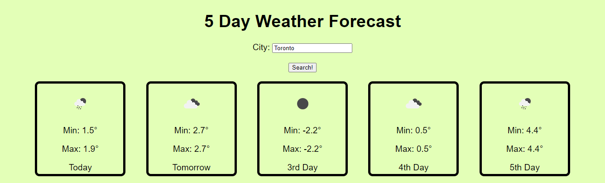

# Code Quiz

## Description

A weather dashboard that will run in the browser and feature dynamically updated HTML and CSS using data retrieved from the OpenWeatherMap API.

## Deployment

https://mariot573.github.io/weather-dashboard/

## Screenshots

